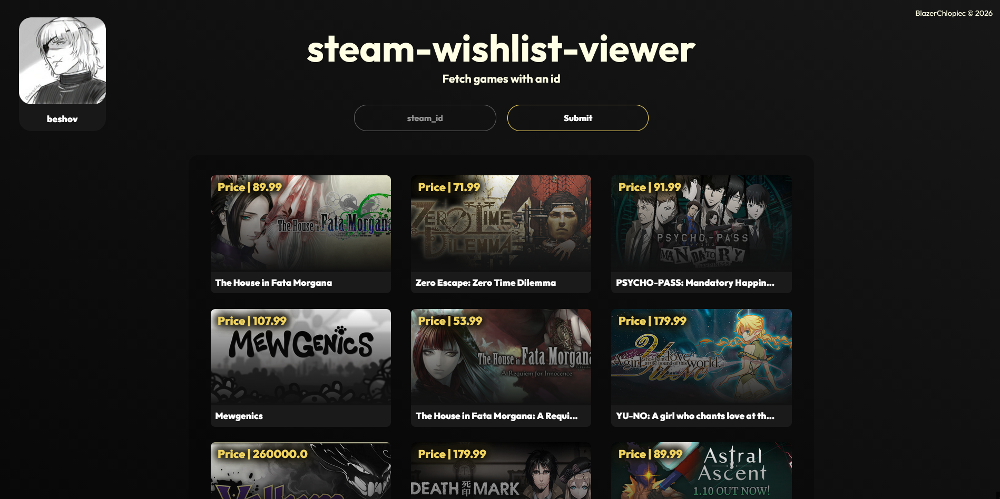

# steam-wishlist-viewer

Fetches wishlisted games from a steam profile and lists them accordingly with references to cheaper keyshop deals on third-party websites.
Made in flask.py


## Run Locally

Clone the project

```bash
  git clone https://github.com/BlazerChlopiec/steam-wishlist-viewer.git
```

Go to the project directory

```bash
  cd steam-wishlist-viewer-main
```

Install dependencies

```bash
  pip install -r requirements.txt
```

Start the server

```bash
  python __init__.py
```


## .env

| Key | Type     | Description                |
| :-------- | :------- | :------------------------- |
| `STEAM_KEY` | `string` | **Required** |

<br>
